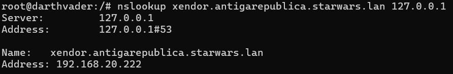
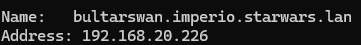

## Tarefa 1.5 - Subdominios

1. Instala no equipo lukeskywalker un subdominio hamado "mestre", e dentro del os rexistros 
    - A, kitfisto 192.168.20.212
    - A, macewindu 192.168.20.213.

    Captura a zonas, e un cliente resolvendo un rexistro A do dominio e do subdominio contra lukeskywalker

**SOLUCION:**

- Creamos o subdominio "mestre" na zona directa do servidor Lukeskywalker

    

- Engadimos os rexistros A dentro do subsominio mestre:

    

- Realizamos a comprobación:

    

    

2. Instala no equipo hansolo (Windows 2012) un subdominio delegado de "academia.jedi" chamado consello. . Engade nel os rexistros:
    - A, yaddle 192.168.20.215
    - A, yaraelpoof 192.168.20.216

    Captura as dúas zonas, e un cliente resolvendo un rexistro  A do dominio e do subdominio contra hansolo e lukeskywalker

**SOLUCION:**

- Delegar o subdominio consello.academia.jedi a hansolo:

    

- Creamos o dubdominio consello no servidor hansolo:

    

- Realizamos comprobación:

    

3. Instala no equipo darthvader un subdominio chamado antigarepublica, e nel os rexistros:
    - A, xendor 192.168.20.222
    - A, ardenlyn 192.168.20.223.

    Captura as dúas zonas, e un cliente resolvendo un rexistro  A do dominio e do subdominio contra darthvader

**SOLUCION**

- Captura da zona:

    

- Comprobación:

    

4. Instala no equipo leia (Debian/Ubuntu Server) un subdominio delegado de "starwars.lan" chamado imperio. Engade nel os rexistros:
    - A, tsuichoi 192.168.20.225
    - A, bultarswan 192.168.20.226.

    Captura as dúas zonas, e un cliente resolvendo un rexistro  A do dominio e do subdominio contra leia e darthvader

**SOLUCION**

- Fichero db.starwars.lan:

    

- Ficheiro named.conf.local do servidor leia:

    

- Ficheiro db.imperio.starwars.lan do servidor leia:

    
    
- Comprobación:

    - Leia:

        
    
    - Darthvader:

        
        
        